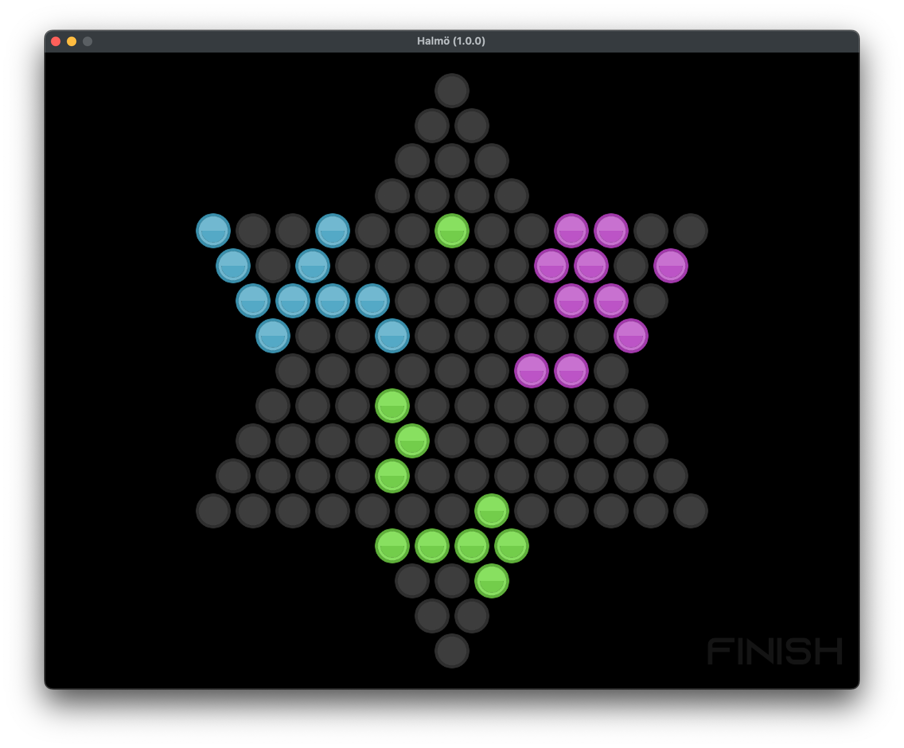

# Halmö

Chinese checkers



## Development

Recompile protobuf:

```
protoc -I. --python_out=app/server halmo.proto
```

Regenerate `loader.lua`:

```
scripts/gen-loader.py
```

Install client dependencies (macOS):

```
brew install lua@5.1 luarocks love

scripts/install.sh
```

Run the game:

```
( cd app && love . )
```

Install server dependencies:

```
python3 -m venv .venv
. .venv/bin/activate
pip install --upgrade pip
pip install -r requirements.txt
```

Run the server:

```
( cd app && server/server.py )
```
